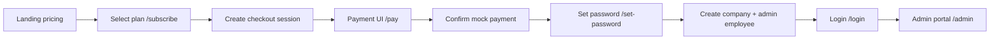
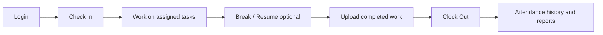
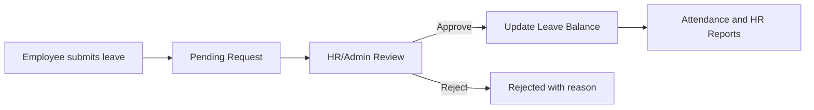
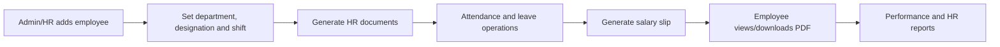
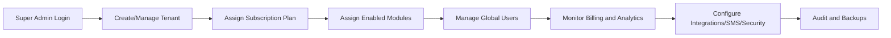
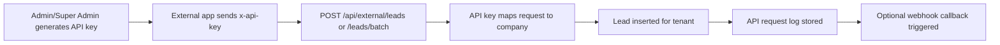
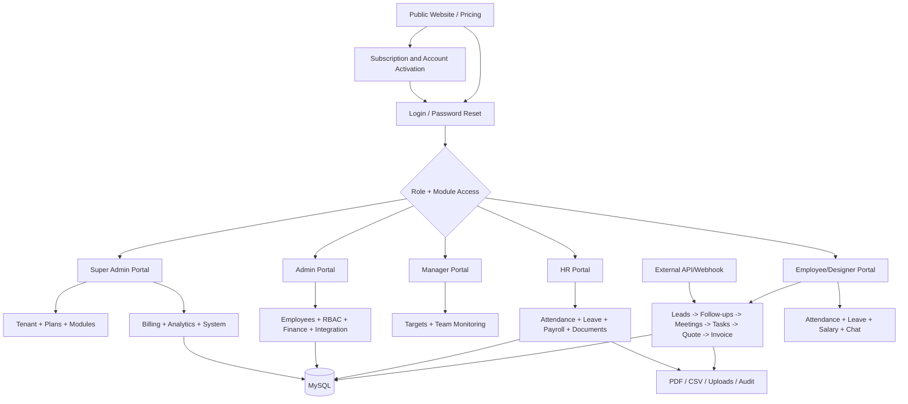

# MARCOM Street CRM + HRMS: Complete Features, Routes and Workflow Guide

## 1. Document Ka Purpose

Yeh document poore current project code ko dekhkar banaya gaya consolidated workflow map hai. Iska use aap:

- complete application workflow diagram banane ke liye,
- role-wise screen flow samajhne ke liye,
- frontend route se backend API route mapping ke liye,
- CRM, HRMS, Admin aur Super Admin process design ke liye

kar sakte hain.

**Code sources checked:** `frontend/src/App.jsx`, layouts, authentication utility, frontend API calls, `backend-node/server.js`, middleware aur `backend-node/routes/*`.

**Important:** "Implemented" ka matlab route/page code present hai. Actual production use ke liye database schema, permissions aur runtime testing alag se validate karna hoga.

---

## 2. Project Ka High-Level Structure

| Layer | Technology | Role |
| --- | --- | --- |
| Frontend | React + Vite + React Router | UI screens, browser routing, role-based page guard |
| API Client | Axios (`frontend/src/utils/api.js`) | `/api` calls, Bearer token attach, multipart support |
| Backend | Node.js + Express | API routes, authentication, business logic, PDF/files |
| Database | MySQL (`marcom_street_crm`) | employees, companies, leads, attendance, billing, HR data |
| File Storage | `uploads/` | HR documents, salary slips, chat files, task work files |

### Development Request Flow

```text
Browser on http://localhost:5173
  -> React page route
  -> Axios request to /api/... or /serve-pdf
  -> Vite proxy
  -> Node backend on http://localhost:3000
  -> Express route + middleware
  -> MySQL / uploads folder
  -> JSON, CSV or PDF response
```

### Production Request Flow

```text
Browser
  -> Node backend on configured PORT
  -> Express serves frontend/dist
  -> Same Node process handles /api, /serve-pdf, /uploads and /backend/assets
```

---

## 3. Roles Aur Portal Access

| Role | Default Portal | Primary Work |
| --- | --- | --- |
| Super Admin (`superadmin`, `super_admin`) | `/superadmin` | SaaS platform, tenants, subscriptions, modules, analytics, integrations |
| Admin | `/admin` | Company operations, employees, finance, reports, settings, RBAC |
| Manager | `/manager` | Team CRM, targets, assignments, approvals and monitoring |
| HR (`human_resources`, `hr`, variants) | `/hr` | Employees, attendance, leave, payroll, documents and HR policies |
| Employee / Sales | `/` or `/employee-dashboard` | Own leads, tasks, meetings, attendance, leave, salary and chat |
| Designer | `/` dashboard branch | Designer dashboard backed by `/api/designer/dashboard` |
| Designer Manager | `/` dashboard branch | Design management dashboard backed by `/api/designer-manager/dashboard` |
| Company/Client portal | `/company/details` | Intended company detail view; current wiring issue is noted later |

### Module Access Logic

Login response me `access_modules` aur `module_restricted` milte hain. Frontend ke route guards:

| Guard | Allowed Area |
| --- | --- |
| `CrmRoute` | CRM pages: leads, meetings, tasks, quotations, invoices, reports, history, WhatsApp, group meetings |
| `HrmsRoute` | HRMS pages: attendance, leaves, salary, documents and other HR modules |
| `AdminRoute` | Admin/Super Admin with CRM module access |
| `ManagerRoute` | Manager/Admin/Super Admin with CRM module access |
| `HRRoute` | HR/Admin/Super Admin with HRMS module access |
| `SuperAdminRoute` | Only Super Admin |

Self-service `hrms_attendance`, `hrms_leaves` and `hrms_salary` are allowed by frontend access utility even when employee module restrictions exist.

---

## 4. Complete Feature Inventory

### 4.1 Public Website, Pricing and SaaS Onboarding

| Feature | What It Does | UI Route | API |
| --- | --- | --- | --- |
| Landing page | Product presentation and plan cards | `/` when logged out | `GET /api/billing/plans` |
| Plan selection | Customer selects Starter/Business/Enterprise | `/subscribe?plan=...` | `POST /api/billing/checkout` |
| Payment screen | Captures selected method and marks session paid | `/pay?session=...` | `POST /api/billing/confirm` |
| Account activation | User creates password; company and admin user are created | `/set-password?session=...` | `POST /api/billing/activate` |

**Current implementation detail:** payment confirmation creates a `MOCK-...` gateway reference. It is a workflow/demo confirmation, not an integrated real payment gateway.

### 4.2 Authentication and Security

| Feature | What It Does | UI/API |
| --- | --- | --- |
| Employee login | Email/password login; JWT stored in browser | `/login`, `POST /api/auth/login` |
| Logout | Clears frontend auth; backend validates token | `POST /api/auth/logout` |
| SMS OTP reset | Request OTP, verify OTP, set password | Login screen and `/api/auth/forgot-password/*` |
| Email OTP reset | Separate forgot-password pages | `/forgot-password`, `/forgot-password/verify`, `/forgot-password/reset` |
| JWT validation | Checks active employee and `tokenVersion` | `verifyToken` middleware |
| Super Admin validation | Allows only normalized Super Admin role | `verifySuperAdmin` middleware |
| API key validation | Protects external lead ingestion endpoints | `verifyApiKey` middleware |
| Audit logging | Non-blocking log of API calls and status codes | `apiAuditLogger` middleware |
| Super Admin hiding | Removes Super Admin identity data from ordinary user API responses | `hideSuperAdminData` middleware |

### 4.3 CRM and Sales Lifecycle

| Feature | Capabilities | Main UI Route | Main API Prefix |
| --- | --- | --- | --- |
| Lead management | Create, edit, status, delete, search, filter, export, assign employee | `/leads`, `/manager/leads`, `/admin/leads` | `/api/leads` |
| Follow-ups | Schedule call/email/WhatsApp/meeting follow-up; complete/miss/cancel | `/followups`, `/manager/followups` | `/api/followups` |
| Client meetings | Schedule meeting, summary, MOM/outcome, status | `/meetings`, `/manager/meetings` | `/api/meetings` |
| Group meetings | Search/filter, create, edit, status, delete | `/group-meetings`, `/manager/group-meetings` | `/api/group-meetings` |
| Tasks | Personal tasks, linked lead, priorities, assignment, work-file upload, completion | `/tasks`, `/manager/tasks` | `/api/tasks` |
| Quotations | Items, tax/discount, draft, send for approval, accept/reject | `/quotations`, `/manager/quotations` | `/api/quotations` |
| Invoices | Items, taxes/TDS/discount, status, PDF download, edit/delete | `/invoices`, `/manager/invoices` | `/api/invoices` |
| Reports | Generate/download own CRM reports, sample reporting | `/reports`, `/sample-reports` | `/api/reports` |
| Activity/history | Logged activities and WhatsApp hit history | `/history`, `/whatsapp-hits` | `/api/activities`, `/api/whatsapp` |
| AI guidance/score | Lead guidance and admin lead scoring view | component/Admin page | `/api/ai`, `/api/admin/ai-lead-score` |

### 4.4 HRMS and Employee Lifecycle

| Feature | Capabilities | UI Route | Main API |
| --- | --- | --- | --- |
| Attendance | Punch in/out, break/resume, working timer, history, HR edit, CSV report | `/hr/hrms/attendance`, `/hrms/attendance` | `/api/checkin`, `/api/hrms/attendance` |
| Auto punch-out | Midnight backend process closes previous day's open attendance | Background service | `services/workTimer` from `server.js` |
| Leaves | Employee apply, HR/Admin approve/reject, leave types and balance | `/hr/hrms/leaves`, `/hrms/leaves` | `/api/hrms/leaves`, `/api/hrms/leave-types`, `/api/hrms/leave-balances` |
| Salary slips | Create/edit/delete slips and open/download PDF | `/hr/hrms/salary`, `/hrms/salary-slips` | `/api/hrms/salary` |
| HR documents | Upload and generate offer, experience, joining and full-and-final PDFs | `/hr/hrms/documents`, `/hrms/documents` | `/api/hrms/documents`, `/api/hrms/generate_document` |
| Departments | Maintain department master | `/hr/hrms/departments` | `/api/departments` |
| Designations | Maintain designation master | `/hr/hrms/designations` | `/api/hrms/designations` |
| Shifts | Shift master and employee shift assignments | `/hr/hrms/shifts` | `/api/hrms/shifts` |
| Holidays | Holiday calendar maintenance | `/hr/hrms/holidays` | `/api/hrms/holidays` |
| Announcements | Current company announcements maintenance/display | `/hr/hrms/announcements` | `/api/hrms/announcements` |
| Performance | Employee performance review CRUD | `/hr/hrms/performance` | `/api/hrms/performance` |
| HR settings | HR configuration key/value settings | `/hr/hrms/settings` | `/api/hrms/settings` |
| HR exports | Employee, leave and payroll CSV reports | `/hr/hrms/reports` | `/api/hrms/reports/*` |
| Joining workflow support | QR/token creation, submissions and verification APIs | UI files exist but not routed | `/api/hrms/generate_qr`, `/joining_submissions`, `/verify_joining` |

### 4.5 Admin, Finance and Operations

| Feature | Capabilities | UI Route | API |
| --- | --- | --- | --- |
| Admin dashboard | Operational KPIs | `/admin` | `GET /api/admin/dashboard` |
| Employees | Add/edit/deactivate/delete, reset password, module access | `/admin/employees` and `/hr/employees` | `/api/admin/employees` |
| Task assignment | Assign/manage company tasks | `/admin/task-assignment` | `/api/admin/tasks` |
| Attendance monitor | View and export attendance | `/admin/attendance` | `/api/admin/attendance`, `/api/hrms/attendance/report` |
| Revenue/insights | Revenue and operational insight dashboards | `/admin/revenue`, `/admin/insights` | `/api/admin/revenue`, `/api/admin/insights` |
| Inventory | Stock, barcode/item-code lookup, assignment | `/admin/inventory` | `/api/inventory` |
| Bank accounts | Maintain company accounts | `/admin/accounts` | `/api/accounts` |
| Expenses | Expense log and CSV export | `/admin/expenses` | `/api/expenses` |
| API integration | API keys, webhook URL, single/batch lead test ingestion | `/admin/api-integration` | `/api/admin/api-keys`, `/api/external/*` |
| Audit logs | Company API audit visibility | `/admin/audit-logs` | `/api/admin/audit-logs` |
| Company settings | Branding/logo/settings | `/admin/company-settings` | `/api/admin/company-settings` |
| RBAC | Role and permission configuration | `/admin/rbac` | `/api/admin/rbac/*` |
| Offer letter generator | Generate document for selected employee | `/admin/generate-document/:employeeId` | `/api/admin/generate_offer_letter` |

### 4.6 Super Admin SaaS Command Center

| Feature Area | Capabilities | UI Route | API Prefix |
| --- | --- | --- | --- |
| Dashboard/metrics | Global company/user/subscription metrics | `/superadmin` | `/api/superadmin/metrics` |
| Companies | Tenant creation, edit, delete, activate/deactivate, assign plan/modules | `/superadmin/companies` | `/api/superadmin/companies`, `/modules` |
| Subscription plans | Plans, company subscriptions, invoices | `/superadmin/subscriptions` | `/api/superadmin/subscriptions` |
| Subscription requests | Approve/reject incoming plan request records | `/superadmin/billing/requests` | `/api/superadmin/subscriptions/requests` |
| Module manager | Master modules, plan mapping, company assignment | `/superadmin/modules` | `/api/superadmin/modules` |
| Global users | User create/edit/block/reset/delete | `/superadmin/users` | `/api/superadmin/users` |
| CRM control | Global pipeline, stages and lead source masters | `/superadmin/crm` | `/api/superadmin/crm` |
| HRMS control | Leave policy, attendance rules, shifts and payroll templates | `/superadmin/hrms-control` | `/api/superadmin/hrms-config` |
| Billing | SaaS invoices and transactions | `/superadmin/billing/invoices`, `/transactions` | `/api/superadmin/billing` |
| Feature flags | Create/update/toggle feature flags | `/superadmin/feature-flags` | `/api/superadmin/feature-flags` |
| Analytics | Revenue and usage analysis | `/superadmin/analytics/revenue`, `/usage` | `/api/superadmin/analytics` |
| Integrations | Global API keys and webhooks | `/superadmin/integrations/api`, `/webhooks` | `/api/superadmin/integrations` |
| Notifications | Email templates and notification logs | `/superadmin/notifications/email-templates` | `/api/superadmin/notifications` |
| Security | Login sessions and ending sessions | `/superadmin/security/login-sessions` | `/api/superadmin/security` |
| Settings/SMS | Platform settings and SMS OTP test/configuration | `/superadmin/settings` | `/api/superadmin/settings` |
| Backup system | Backup list/create/delete/export | `/superadmin/system/backups` | `/api/superadmin/system` |
| Audit log | Super Admin actions/API history | `/superadmin/audit-logs` | `/api/superadmin/logs` |

### 4.7 Communication, Files and Integration

| Feature | Flow | API/URL |
| --- | --- | --- |
| Internal chat | User list, messages, attachments, unread count and notifications | `GET/POST /api/chat` |
| Chat files | Uploaded to `uploads/chat/messages` | Served under `/uploads/...` |
| Task work attachment | Employee uploads completion work file | `POST /api/tasks/update_status` |
| PDF viewer/download | HR/salary PDFs from allow-listed upload folders | `GET /serve-pdf?file=...` |
| Invoice PDF | Backend-generated letterhead invoice PDF | `GET /api/invoices/:id/pdf` |
| External lead intake | API-key based single and batch lead create | `/api/external/leads`, `/leads/batch` |
| Incoming webhook lead | API-key + source-header based lead ingestion | `/api/webhook/webhook/leads` |
| Outgoing lead notification | External lead creation triggers configured callback URL from API key record | Public API service |

---

## 5. Frontend Browser Routes

### 5.1 Public and Authentication Routes

| Route | Screen/Use | Guard |
| --- | --- | --- |
| `/` | Logged out: landing page; logged in: portal dashboard/router | `PrivateRoute` falls back to landing |
| `/login` | Employee/admin/role login and SMS reset entry | Public |
| `/forgot-password` | Email OTP request | Public |
| `/forgot-password/verify` | Email OTP verify | Public |
| `/forgot-password/reset` | Email reset password | Public |
| `/company/login` | Company registration/login page | Public |
| `/subscribe` | Plan signup information form | Public |
| `/pay` | Payment confirmation UI | Public |
| `/set-password` | Paid account activation/password setup | Public |

### 5.2 Employee/Common Routes

| Route | Feature |
| --- | --- |
| `/employee-dashboard` | Employee CRM dashboard |
| `/leads` | Leads |
| `/meetings` | Client meetings |
| `/tasks` | Personal tasks/assigned tasks |
| `/followups` | Follow-ups |
| `/quotations` | Quotations |
| `/invoices` | Invoices |
| `/reports` | Reports |
| `/sample-reports` | Sample reporting |
| `/client-history` | Client interaction history |
| `/group-meetings` | Group meetings |
| `/history` | History/activity |
| `/whatsapp-hits` | WhatsApp history |
| `/company-management` | CRM-side company records |
| `/hrms/leaves` | Self-service leave |
| `/hrms/attendance` | Self-service attendance |
| `/hrms/documents` | Employee HR documents |
| `/hrms/salary-slips` | Employee salary slips |
| `/chat` | Team chat |
| `/calendar` | Meeting calendar |
| `/notifications` | Chat notification inbox |

### 5.3 Manager Routes

All are under `/manager` and require Manager/Admin/Super Admin with CRM access:

| Route | Feature |
| --- | --- |
| `/manager` | Manager dashboard and targets |
| `/manager/leads` | Team leads |
| `/manager/meetings` | Meetings |
| `/manager/tasks` | Tasks |
| `/manager/followups` | Follow-ups |
| `/manager/quotations` | Quotation approval/view |
| `/manager/invoices` | Invoices |
| `/manager/reports` | Reports |
| `/manager/sample-reports` | Report preview |
| `/manager/client-history` | Client history |
| `/manager/group-meetings` | Group meetings |
| `/manager/history` | Activity history |
| `/manager/whatsapp` | WhatsApp hits |
| `/manager/hrms/attendance` | Attendance self-service |
| `/manager/hrms/leaves` | Leave self-service |
| `/manager/chat` | Chat |
| `/manager/calendar` | Calendar |

### 5.4 HR Routes

All are under `/hr` and require HR/Admin/Super Admin with HRMS access:

| Route | Feature |
| --- | --- |
| `/hr` | HR dashboard |
| `/hr/employees` | Employees |
| `/hr/meetings` | Meetings, only when CRM access is available |
| `/hr/hrms/attendance` | Attendance and reports |
| `/hr/hrms/leaves` | Leaves, types and rules |
| `/hr/hrms/documents` | HR document generation/uploads |
| `/hr/hrms/salary` | Salary slip generation |
| `/hr/hrms/departments` | Departments |
| `/hr/hrms/designations` | Designations |
| `/hr/hrms/shifts` | Shift management |
| `/hr/hrms/holidays` | Holidays |
| `/hr/hrms/announcements` | Announcements |
| `/hr/hrms/performance` | Performance reviews |
| `/hr/hrms/settings` | Settings |
| `/hr/hrms/reports` | CSV reports |
| `/hr/calendar` | Calendar |

### 5.5 Admin Routes

All are under `/admin` and require Admin/Super Admin with CRM access:

| Route | Feature |
| --- | --- |
| `/admin` | Dashboard |
| `/admin/leads`, `/followups`, `/quotations`, `/invoices` | CRM operations |
| `/admin/chat`, `/calendar` | Communication and meetings |
| `/admin/employees`, `/departments`, `/task-assignment` | People/tasks |
| `/admin/attendance` | Attendance view/report |
| `/admin/revenue`, `/insights`, `/ai-lead-score` | Intelligence |
| `/admin/inventory`, `/accounts`, `/expenses` | Finance/assets |
| `/admin/api-integration`, `/audit-logs` | Integrations/auditing |
| `/admin/company-settings`, `/rbac` | Configuration/permissions |
| `/admin/reports` | Reports |
| `/admin/generate-document/:employeeId` | Offer/document generation |

### 5.6 Super Admin Routes

All are under `/superadmin` and require Super Admin:

| Route | Feature |
| --- | --- |
| `/superadmin` | SaaS dashboard |
| `/superadmin/companies` | Tenant management |
| `/superadmin/subscriptions`, `/plans` | Plans and subscriptions |
| `/superadmin/modules` | Module manager |
| `/superadmin/users` | Global users |
| `/superadmin/audit-logs`, `/settings` | Platform system administration |
| `/superadmin/crm`, `/hrms-control` | Product control |
| `/superadmin/billing/invoices`, `/billing/transactions`, `/billing/requests` | Billing workflows |
| `/superadmin/feature-flags` | Feature toggles |
| `/superadmin/analytics/revenue`, `/analytics/usage` | Analytics |
| `/superadmin/integrations/api`, `/integrations/webhooks` | Integrations |
| `/superadmin/notifications/email-templates` | Notifications |
| `/superadmin/security/login-sessions` | Sessions |
| `/superadmin/system/backups` | Backup management |

---

## 6. Backend Route Prefixes and Endpoint Map

### Access Labels

| Label | Meaning |
| --- | --- |
| Public | No JWT middleware on the handler |
| JWT | Valid logged-in employee JWT required |
| Admin/HR/Manager | JWT plus role check inside route |
| SuperAdmin | JWT plus Super Admin middleware |
| API Key | `x-api-key` header or `api_key` query required |

### 6.1 Health, Files and Authentication

| Prefix | Access | Endpoints / Purpose |
| --- | --- | --- |
| `/api/check` | Public | `GET /` backend health/build/query mode |
| `/api/auth` | Mixed | `POST /login`, `POST /logout`; SMS reset: `GET /forgot-password/sms-status`, `POST /forgot-password/request-otp`, `/verify-otp`, `/reset` |
| `/api/auth/forgot-password/email` | Public | `POST /request`, `/verify`, `/resend`, `/reset` |
| `/serve-pdf` | Public path allow-list | `GET /?file=uploads/hr_documents/...` or salary slips; inline/download PDF |
| `/uploads` | Static | Direct static uploads serving |
| `/backend/assets` | Static | Backend logos/watermarks/assets |

### 6.2 CRM and Employee Productivity APIs

| Prefix | Access | Endpoints |
| --- | --- | --- |
| `/api/dashboard` | JWT | `GET /` dashboard counts |
| `/api/leads` | JWT | `GET /`, `POST /`, `POST /crud`, `PUT /crud`, `PUT /update_status`, `PUT /:id`, `DELETE /crud`, `GET /export` |
| `/api/followups` | JWT | `GET /`, `POST /`, `POST /create`, `PUT /update_status` |
| `/api/meetings` | JWT | `GET /`, `GET /summary`, `POST /`, `POST /create`, `POST /update_outcome`, `PATCH /:id/status` |
| `/api/group-meetings` | JWT | `GET /`, `POST /`, `PUT /:id`, `PATCH /:id/status`, `DELETE /:id` |
| `/api/tasks` | JWT | `GET /`, `GET /assignees`, `POST /`, `POST /assign`, `PUT /update_status`, `PUT /:id`, `POST /update_status` with work file |
| `/api/quotations` | JWT | `GET /`, `POST /`, `PUT /:id/send`, `PUT /:id/approve`, `DELETE /` |
| `/api/invoices` | JWT | `GET /`, `POST /`, `GET /:id/pdf`, `PUT /:id`, `PATCH /:id/status`, `DELETE /:id` |
| `/api/reports` | JWT | `GET /`, `GET /sample`, `POST /create`, `GET /download` |
| `/api/activities` | JWT | `GET /`, `POST /create` |
| `/api/whatsapp` | JWT | `GET /` |
| `/api/ai` | JWT | `GET /guidance` |

### 6.3 Attendance and HRMS APIs

| Prefix | Access | Endpoints |
| --- | --- | --- |
| `/api/checkin` | JWT | `GET /status`, `/today`, `/history`; `POST /clock-in`, `/start-break`, `/end-break`, `/clock-out`, `/reset-timer`, `/checkin` legacy action endpoint |
| `/api/hrms` | Public diagnostics | `GET /__ping`, `GET /__routes` |
| `/api/hrms` | JWT | Documents: `GET/POST /documents`, `DELETE /documents/:id`, `POST /generate_document` |
| `/api/hrms` | JWT | Salary: `GET/POST /salary`, `GET /salary/:id/pdf`, `PUT/DELETE /salary/:id` |
| `/api/hrms` | JWT | Leave: `GET/POST/PUT /leaves`, `GET/POST/PUT/DELETE /leave-types`, `GET/PUT /leave-balances` |
| `/api/hrms` | JWT | Attendance: `GET/POST /attendance`, `PUT /attendance/:id`, `GET /attendance/report`, `GET /stats` |
| `/api/hrms` | JWT | Joining: `GET /joining_submissions`, `POST /verify_joining`, `POST /generate_qr` |
| `/api/hrms` | JWT | Master data: `GET/POST/PUT/DELETE /designations`, `/shifts`, `/holidays`, `/announcements`, `/performance`; shift assignment routes |
| `/api/hrms` | JWT | Settings/reports: `GET/PUT /settings`, `GET /reports/employees`, `/reports/leaves`, `/reports/payroll` |
| `/api/departments` | JWT | `GET/POST /`, `PUT/DELETE /:id` |
| `/api/employees` | JWT | `GET /` employee lookup/list |
| `/api/hr-documents` | JWT | `GET/POST /`, `GET /:id/download`, `DELETE /:id` legacy/alternate document API |

### 6.4 Admin, Manager and Finance APIs

| Prefix | Access | Endpoints |
| --- | --- | --- |
| `/api/manager` | Manager/Admin/SuperAdmin | `GET/POST /targets` |
| `/api/admin` | Admin/Manager/SuperAdmin depending handler | `GET /dashboard`, `/attendance`, `/insights`, `/revenue`; task CRUD and status |
| `/api/admin` | Admin/HR depending handler | Employee CRUD, password reset, status, document generation |
| `/api/admin` | Admin only where enforced | Company settings/logo, RBAC roles/permissions/mapping |
| `/api/admin` | Admin/Manager/SuperAdmin | API keys, audit logs, companies, AI lead score |
| `/api/inventory` | JWT | `GET/POST /`, `GET /lookup/:code`, `PUT/DELETE /:id` |
| `/api/accounts` | JWT | `GET/POST /`, `PUT/DELETE /:id` |
| `/api/expenses` | JWT | `GET/POST /`, `DELETE /:id`, `GET /export` |
| `/api/companies` | Mixed | Public `POST /login`; JWT `GET /`, `/history`, `/:id`, `/:id/leads`, `/:id/meetings`, `/:id/quotations`, `PUT /update`, `POST /` |
| `/api/designer` | JWT | `GET /dashboard` |
| `/api/designer-manager` | JWT | `GET /dashboard` |

### 6.5 Billing and Integration APIs

| Prefix | Access | Endpoints |
| --- | --- | --- |
| `/api/billing` | Public | `GET /plans`, `POST /checkout`, `POST /confirm`, `POST /activate` |
| `/api/external` | API Key | `POST /leads`, `POST /leads/batch`, `POST /webhook/leads` |
| `/api/webhook` | API Key | Same router mount; incoming lead webhook full route is `/api/webhook/webhook/leads` |

### 6.6 Super Admin APIs

| Prefix | Endpoints / Purpose |
| --- | --- |
| `/api/superadmin/companies` | Company list/create/update/delete, status and plan changes |
| `/api/superadmin/subscriptions` | Plan list/save, company subscription assignment, invoices, plan requests approval |
| `/api/superadmin/users` | User list/detail/create/edit, block/unblock, reset password, delete |
| `/api/superadmin/logs` | Audit log listing |
| `/api/superadmin/settings` | Settings read/save and SMS test; note `GET /` is currently not protected in route code |
| `/api/superadmin/metrics` | Platform dashboard metrics |
| `/api/superadmin/modules` | Module CRUD, get/assign modules for company |
| `/api/superadmin/crm` | CRM overview, pipelines, stages and source CRUD |
| `/api/superadmin/hrms-config` | HR overview, leave policies, attendance rules, shift/payroll templates |
| `/api/superadmin/billing` | Plans, SaaS invoices and transactions |
| `/api/superadmin/feature-flags` | Feature flag CRUD/toggle |
| `/api/superadmin/analytics` | Revenue and usage analytics |
| `/api/superadmin/integrations` | API key creation/revoke and webhook CRUD/status |
| `/api/superadmin/notifications` | Templates and log listing |
| `/api/superadmin/security` | Login session list/end |
| `/api/superadmin/system` | Health and backup list/create/delete/export |

---

## 7. Route Kaise Chal Raha Hai: Technical Execution

### 7.1 Login Ke Baad Portal Selection

```mermaid
flowchart TD
  A[User enters email/password at /login] --> B[POST /api/auth/login]
  B --> C{Employee valid and active?}
  C -- No --> D[Login error]
  C -- Yes --> E[JWT + employee + access_modules returned]
  E --> F[Save employee and token in localStorage]
  F --> G{Role and allowed modules}
  G -->|Super Admin| H[/superadmin]
  G -->|Admin + CRM| I[/admin]
  G -->|Manager + CRM| J[/manager]
  G -->|HR + HRMS| K[/hr]
  G -->|Employee or Designer| L[/ dashboard branch]
```

### 7.2 Every Authenticated API Call

```text
Page component
  -> api.get/post/put/delete('/some-route')
  -> Axios prepends /api and sends Authorization: Bearer <token>
  -> server.js matches mounted prefix
  -> apiAuditLogger begins non-blocking audit capture
  -> route's verifyToken validates JWT and active employee
  -> optional role middleware validates permission
  -> route runs SQL/file/PDF logic
  -> hideSuperAdminData sanitizes non-superadmin JSON response
  -> browser gets response and UI updates
```

### 7.3 Frontend Guard Routing

```text
URL opened
  -> React Router in App.jsx
  -> PrivateRoute / CrmRoute / HrmsRoute / role route wrapper
  -> token, role and module access checked in browser
  -> allowed: Layout + selected page component renders
  -> not allowed: login or default permitted portal redirect
```

---

## 8. End-to-End Business Workflows

### 8.1 New SaaS Customer Subscription to Admin Login



| Step | UI | API | Stored Data/Result |
| --- | --- | --- | --- |
| Display plans | `/` | `GET /api/billing/plans` | Plan cards |
| Signup details | `/subscribe` | `POST /api/billing/checkout` | `subscription_sessions` pending row |
| Confirm payment | `/pay` | `POST /api/billing/confirm` | Session paid, mock gateway ref |
| Activate | `/set-password` | `POST /api/billing/activate` | Company + admin employee created |
| Sign in | `/login` | `POST /api/auth/login` | JWT and access modules |

### 8.2 Lead to Invoice CRM Workflow

```mermaid
flowchart LR
  A[Lead Capture] --> B[Assign Owner and Priority]
  B --> C[Follow-up Schedule]
  C --> D[Meeting and MOM]
  D --> E[Task Execution]
  E --> F[Quotation Draft]
  F --> G[Send for Manager Approval]
  G -->|Accepted| H[Invoice Creation]
  G -->|Rejected| F
  H --> I[Invoice PDF / Status Paid]
```



| Process | Route/API | Main Status/Action |
| --- | --- | --- |
| Capture lead manually | `/leads`, `POST /api/leads/crud` | Default `new`, priority, assigned user |
| Capture lead externally | API integration | API key based insert |
| Progress lead | `PUT /api/leads/update_status` | e.g. new/contacted/won/lost |
| Schedule follow-up | `POST /api/followups/create` | pending/completed/missed/cancelled |
| Schedule meeting | `POST /api/meetings/create` | scheduled |
| Complete meeting | `POST /api/meetings/update_outcome` | MOM/outcome and completed |
| Execute work | `/tasks`, `POST/PUT /api/tasks/...` | optional completion attachment |
| Create quotation | `POST /api/quotations` | draft or sent |
| Manager decision | `PUT /api/quotations/:id/approve` | accepted/rejected |
| Create invoice | `POST /api/invoices` | items, tax, TDS, discount |
| Share invoice PDF | `GET /api/invoices/:id/pdf` | inline/download PDF |
| Close finance status | `PATCH /api/invoices/:id/status` | paid/overdue/cancelled |

### 8.3 Daily Employee Attendance and Task Workflow



| Activity | UI/API |
| --- | --- |
| Today's timer/status | `GET /api/checkin/today` or `/status` |
| Punch in | `POST /api/checkin/clock-in` or legacy `/checkin` |
| Break/resume | `POST /api/checkin/start-break`, `/end-break` |
| Task status update | `PUT /api/tasks/update_status` |
| Task completion file | `POST /api/tasks/update_status` multipart |
| Punch out | `POST /api/checkin/clock-out` |
| If user forgets punch out | Backend midnight auto-close service |
| HR review/correction | `PUT /api/hrms/attendance/:id` with reason |

### 8.4 Leave Approval Workflow



| Step | UI/API |
| --- | --- |
| Maintain leave types/rules | HR page; `/api/hrms/leave-types` |
| Check own balance | `/api/hrms/leave-balances` |
| Submit leave | `POST /api/hrms/leaves` |
| View team requests | `GET /api/hrms/leaves` for HR/Admin |
| Approve/reject | `PUT /api/hrms/leaves` |
| Report | `GET /api/hrms/reports/leaves?month=YYYY-MM` |

### 8.5 HR Joining, Documents and Payroll Workflow



| Process | UI/API |
| --- | --- |
| Add employee and modules | `/hr/employees` or `/admin/employees`; `/api/admin/employees` |
| Structure setup | Departments, designations, shifts APIs |
| Offer/experience/joining/full-and-final PDF | `POST /api/hrms/generate_document` |
| Upload other document | `POST /api/hrms/documents` |
| Generate/edit salary slip | `/api/hrms/salary` |
| Open salary/document PDF | `/api/hrms/salary/:id/pdf` or `/serve-pdf` |
| Review performance | `/api/hrms/performance` |
| Export employee/payroll records | `/api/hrms/reports/*` |

### 8.6 Manager Team Workflow

```text
Manager login -> /manager dashboard
  -> set monthly targets with /api/manager/targets
  -> view/manage team leads and meetings
  -> assign department tasks through /api/tasks/assign
  -> view pending quotations and accept/reject
  -> monitor follow-ups, invoices, reports and calendar
```

### 8.7 Admin Company Operations Workflow

```text
Admin login -> /admin
  -> maintain employees and department/module access
  -> configure settings and permissions
  -> assign tasks and monitor attendance
  -> manage inventory, accounts and expenses
  -> monitor revenue/insights/audit logs
  -> generate API key for external lead capture
```

### 8.8 Super Admin Platform Workflow



### 8.9 External API Lead Intake Workflow



---

## 9. Suggested Complete Workflow Diagram Nodes

Aap final workflow drawing me in blocks ko arrange kar sakte hain:

| Main Block | Sub-Blocks |
| --- | --- |
| Entry | Landing, Pricing, Subscription, Payment, Login, Forgot Password |
| Access Control | JWT, Role Selection, Module Permission, Portal Redirect |
| Super Admin | Tenant, Subscription, Module, Users, Billing, Analytics, Integrations, Settings, Backup |
| Admin | Employee, RBAC, Attendance, Tasks, Finance, Inventory, API Integration, Reports |
| Manager | Targets, Team Tasks, Leads, Meetings, Quotation Approval, Reports |
| HR | Onboarding, Attendance, Leaves, Payroll, HR Documents, Shift, Holiday, Performance |
| Employee | Check-in, Leads, Follow-up, Tasks, Meetings, Quotation, Invoice, Leave, Salary Slip, Chat |
| External Integration | API Key, Single Lead, Batch Import, Webhook |
| Storage and Output | MySQL, PDFs, CSV exports, Uploads, Audit Logs |

### One-Page Master Workflow



---

## 10. Current Code Notes and Workflow Gaps

Workflow banate waqt in items ko "existing but pending validation/fix" mark karna sahi rahega:

| Area | Current Code Observation | Workflow Impact |
| --- | --- | --- |
| Company portal | Frontend route is `/company/details` without `:id`, but `CompanyDetails` reads `id`; it also expects employee auth although company login stores `company_token` | Client self-service flow currently complete wiring ke bina reliable nahi hai |
| Joining public form | `PublicJoiningForm`, `JoiningQRGenerator` and `JoiningSubmissions` files/APIs exist; `generate_qr` produces a `/#/public/joining-form/:token` URL, but `App.jsx` me corresponding route nahi hai | QR onboarding flow ko diagram me "backend support / frontend route pending" mark karein |
| Admin company page | `AdminCompanies.jsx` file aur `/api/admin/companies` APIs hain, lekin current `App.jsx` me `/admin/companies` route registered nahi hai | Admin tenant/client maintenance screen direct UI flow me absent hai |
| Payment gateway | `/api/billing/confirm` payment ko mock gateway reference se paid mark karta hai | Real Razorpay/Stripe/payment gateway workflow implemented nahi samjhein |
| Designer modules | Designer/Designer Manager page and API files present hain; dashboard backend queries ko runtime/database validation ki zaroorat hai | Designer workflow ko test ke baad production flow me lock karein |
| Marketing labels | Landing page par Email Automation/partner integrations text dikh raha hai; dedicated email automation implementation route verified nahi hua | Marketing feature ko implemented process step na manen jab tak module add/verify na ho |
| File access | `/serve-pdf` path allow-list use karta hai, lekin JWT nahi lagata; `/uploads` static mount bhi available hai | Sensitive document sharing/security rule workflow me separately define karein |
| Role enforcement | Kuch resource APIs sirf `verifyToken` use karte hain, har endpoint par admin role middleware nahi laga | Final approval/security workflow backend authorization review ke baad freeze karein |

---

## 11. Workflow Banane Ka Recommended Order

1. Pehle **Public Signup + Login + Role Redirect** ka top-level flow banao.
2. Uske neeche **Super Admin -> Admin/HR/Manager/Employee** portal branches banao.
3. CRM branch me **Lead -> Follow-up -> Meeting -> Task -> Quotation Approval -> Invoice -> Payment Status** flow rakho.
4. HR branch me **Employee -> Attendance/Leave -> Documents -> Payroll -> Reports** flow rakho.
5. Admin branch me **Settings/RBAC -> Operations/Finance -> API Integration/Audit** rakho.
6. External systems ke liye **API Key/Webhook -> Lead Capture** entry point CRM branch se connect karo.
7. Diagram me dotted/pending blocks se section 10 ke current gaps clearly mark karo.

---

## 12. Quick Route Reference for Workflow Labels

```text
Public:       /, /login, /subscribe, /pay, /set-password, /forgot-password
Super Admin:  /superadmin/*
Admin:        /admin/*
Manager:      /manager/*
HR:           /hr/*
Employee:     /leads, /tasks, /meetings, /followups, /quotations, /invoices, /hrms/*, /chat

Core API:     /api/auth, /api/leads, /api/tasks, /api/meetings, /api/followups,
              /api/quotations, /api/invoices, /api/hrms, /api/admin
Platform API: /api/superadmin/*
External API: /api/external/*, /api/webhook/*
Files/PDF:    /serve-pdf, /uploads, /backend/assets
```
